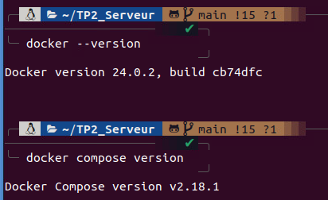
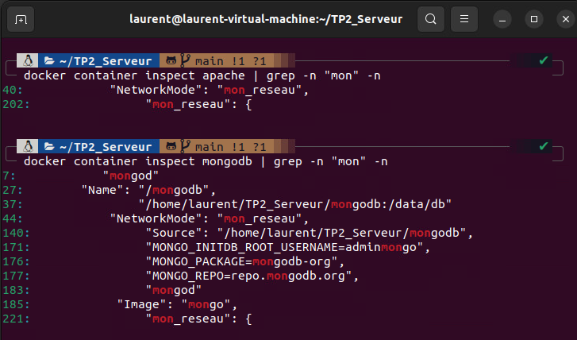

# Travail pratique 2 - 420-w45-SF
## date: 04/07/2023
---
<br>

## Description: verification et container

### SECTION 1 ETAPE 1
---

capture d'ecran des version des composants docker engine et docker version<br>




### SECTION 1 ETAPE 2
---
commande pour la cration d'un reseau
```bash
docker network create mon_reseau
```

commande pour creation des containers apache et mongodb
```bash
//apache
docker run -d -p 80:80 --name apache --network mon_reseau httpd:alpine

//mongodb
docker run --name mongodb --network mon_reseau -e MONGO_INITDB_ROOT_USERNAME=adminmongo -e MONGO_INITDB_ROOT_PASSWORD=EncoreUneAutreBD -v ./mongodb:/data/db -d mongo
```
<BR>
capture d'ecran reseau prive virtuel<br>



